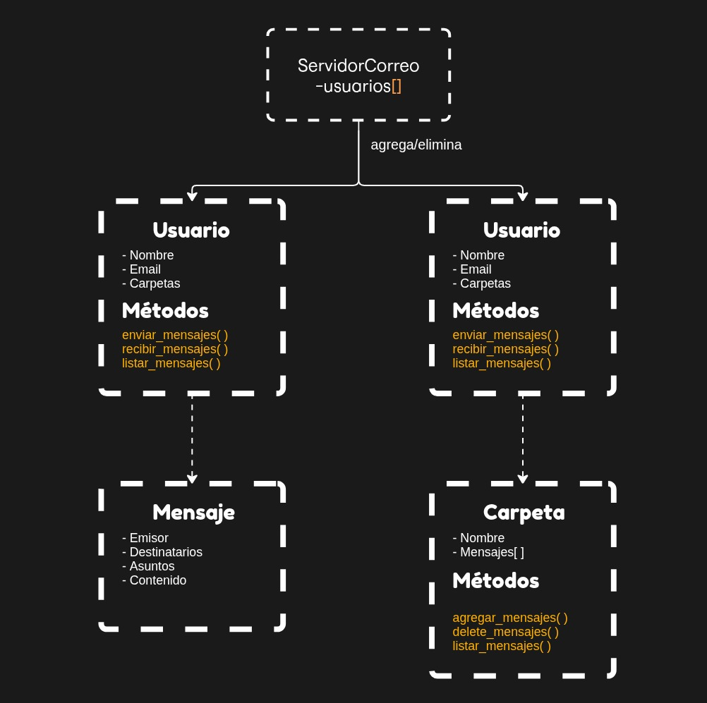

# tp-estructura-de-datos-2025
Aldana Ibarra y Marco de Hoyos

# Sistema de Gestión de Correos en Python
Este proyecto simula un sistema simple de mensajería (entre usuarios) utilizando programación orientada a objetos. Incluye funciones para poder enviar, recibir, listar y organizar mensajes en carpetas que corresponden a una bandeja de entrada.

# Descripción
El sistema simula el comportamiento de un servidor de correo y la interacción de sus usuarios. Cada usuario puede enviar y recibir mensajes, los cuales se almacenan en carpetas específicas. El diseño está basado en principios de abstracción, encapsulamiento y herencia.

# Tecnologías utilizadas
- Python 3.x
- Programación orientada a objetos (OOP)
- Módulo abc para clases abstractas

# Estructura del proyecto
- GestionCorreo: Interfaz abstracta que define los métodos esenciales para la gestión de correos.
- ServidorCorreo: Clase que representa el servidor, gestiona usuarios registrados.
- Usuario: Implementa la interfaz GestionCorreo, representa un usuario con su email y carpetas.
- Mensaje: Clase que modela un mensaje con emisor, destinatarios, asunto y contenido.
- Carpeta: Clase que gestiona los mensajes dentro de una carpeta específica.

# Proceso de elaboración del programa.
1. Inconvenientes para acceder al repositorio remoto para que cada uno pueda trabajar y visualizar el codigo del compañero.
2. Se trabajó en archivos diferentes (individuales) hasta poder reunir el codigo en el repositorio.
3. Durante el primer día se estableció la base principal del codigo, este incluia las distintas clases a utilizar (GestionCorreo(interfaz), ServidorCorreo, Usuario, Mensaje, Carpeta).
4. Posteriormente se implementaron los atributos y los distintos metodos para cada clase.
5. Una vez concluida la estructuración del código se paso a la fase de elaboración del diagrama en base al codigo para poder visualizar la relación entre las clases.

---

## 📌 Descripción del Sistema

El sistema permite simular el manejo de un correo electrónico con funcionalidades básicas como:

### 👤 Usuarios (`usuario.py`)
Cada usuario tiene:
- Un nombre y dirección de email
- Una referencia al servidor al que pertenece
- Tres carpetas por defecto:
  - Inbox (mensajes recibidos)
  - Enviados
  - Papelera

✅ **Envia y recibe mensajes**  
✅ **Puede mover mensajes entre carpetas**  
✅ **Accede a sus carpetas y subcarpetas**  

---

### 📬 Mensajes (`mensaje.py`)
Cada mensaje incluye:
- Emisor
- Lista de destinatarios
- Asunto
- Contenido del mensaje

No incluye fechas ni IDs automáticos (simple y directo).

---

### 🗂️ Carpetas y Subcarpetas (`carpeta.py`)
Las carpetas:
- Guardan mensajes
- Pueden tener subcarpetas
- Pueden buscar mensajes de manera **recursiva**
- Soportan mover mensajes de una carpeta a otra (también recursivo)

#### ✅ Funcionalidades clave:
| Acción                         | Soporte |
|--------------------------------|---------|
| Agregar mensaje                | ✅      |
| Eliminar mensaje               | ✅      |
| Agregar subcarpeta             | ✅      |
| Buscar mensaje (asunto / texto / emisor) | ✅ (recursivo) |
| Mover mensaje entre carpetas/subcarpetas | ✅ (recursivo) |

> Nota: Si el mensaje no se encuentra, el método **no falla**, solo no hace nada.

---

### 🖥️ Servidor (`servidor.py`)
Administración de usuarios en un servidor de correo.

- Agrega y elimina usuarios
- Devuelve todos los usuarios registrados

---

# Diagrama de Flujo (en imagen)

Entrega 2: Estructuras de Datos y Recursividad

Se implementó un sistema de carpetas y subcarpetas usando una estructura recursiva tipo árbol, donde cada carpeta puede contener mensajes y otras carpetas dentro.

El programa permite:

Crear y eliminar carpetas.

Agregar, eliminar y mover mensajes entre carpetas.

Realizar búsquedas recursivas de mensajes por asunto o remitente.

Cada carpeta es un nodo del árbol que contiene una lista de mensajes y una lista de subcarpetas.
Las búsquedas y movimientos se hacen de forma recursiva, recorriendo todo el árbol.

En cuanto a eficiencia:

Crear carpetas o agregar mensajes.

Búsquedas y movimientos recursivos.
